# 🚀 Smart Order Processing & Notification Engine

> A **production-grade Spring Boot backend** demonstrating Clean Architecture, Design Patterns, Redis Caching, Async Messaging, and AWS Cloud Deployment.

[](https://www.java.com)
[](https://spring.io/projects/spring-boot)
[](https://www.docker.com)
[](https://aws.amazon.com)
[](https://www.rabbitmq.com)
[](https://redis.io)

---

## 📌 Table of Contents

- [Overview](#overview)
- [Architecture](#architecture)
- [Design Patterns](#design-patterns)
- [SOLID Principles](#solid-principles)
- [DSA Implementations](#dsa-implementations)
- [Tech Stack](#tech-stack)
- [Project Structure](#project-structure)
- [Request Flow](#request-flow)
- [API Endpoints](#api-endpoints)
- [Cloud Deployment](#cloud-deployment)
- [How to Run Locally](#how-to-run-locally)
- [How to Run with Docker](#how-to-run-with-docker)

---

## 📖 Overview

This project simulates a real-world **Order Processing System** built with production-level standards:

- Orders created with **validated input**, processed with correct **payment strategy**
- **Observer Pattern** auto-reacts to order status changes (email, inventory)
- **Notifications** sent asynchronously via **RabbitMQ** — users never wait
- Frequent reads served from **Redis Cache** — reducing DB load
- **Priority Queue** ensures VIP orders processed first
- **Rate Limiter** prevents order spam (sliding window algorithm)
- **Deployed on AWS** — EC2, RDS PostgreSQL, ECR
- **Dockerized** with multi-stage build for production

---

## 🏗️ Architecture

```
Client (Postman / REST)
          │
          ▼
  [ Controller Layer ]       →   HTTP requests, DTO validation
          │
          ▼
  [ Service Layer ]          →   Business logic + Design Patterns
          │
          ▼
  [ Port Interfaces ]        →   SOLID Dependency Inversion
          │
          ▼
  [ Infrastructure Layer ]   →   Redis · RabbitMQ · PostgreSQL · JPA
```

### Cloud Architecture
```
Developer Machine
      │ git push
      ▼
   GitHub
      │
      ▼
  Docker Build
      │ push image
      ▼
  AWS ECR (Registry)
      │ pull image
      ▼
  AWS EC2 (App Server)
  ├── Spring Boot App
  ├── Redis Container
  └── RabbitMQ Container
      │
      ▼
  AWS RDS (PostgreSQL)
```

---

## 🎨 Design Patterns

| Pattern | Location | Purpose |
|---|---|---|
| 🔨 **Builder** | `Order.java` | Clean object construction with many optional fields |
| ⚡ **Strategy** | `PaymentContext.java` | Swap payment methods at runtime without if-else |
| 👁️ **Observer** | `OrderEventPublisher.java` | Auto-notify Email + Inventory on status change |
| 🏭 **Factory** | `NotificationFactory.java` | Pick right notification sender dynamically |

### Builder Pattern
```java
Order order = new Order.Builder()
    .customerName("Pasindu")
    .productName("Laptop")
    .quantity(2)
    .totalPrice(150000.0)
    .shippingAddress("Colombo")
    .priority(5)
    .paymentType(PaymentType.CREDIT_CARD)
    .build();
```

### Strategy Pattern
```java
// Picks right payment at runtime — no if-else needed
paymentContext.executePayment("CREDIT_CARD", 150000.0);
// Add new payment? Just add one class. Nothing else changes.
```

### Observer Pattern
```java
// All observers notified automatically on status change
eventPublisher.notifyStatusChange(order, OrderStatus.CONFIRMED);
// EmailObserver → fires
// InventoryObserver → fires
// Add SMS? Just create SmsObserver. Service unchanged.
```

### Factory Pattern
```java
// Factory picks right sender — no switch/if-else
NotificationSender sender = notificationFactory.getSender("EMAIL");
sender.send("user@gmail.com", "Your order is confirmed!");
```

---

## 🧱 SOLID Principles

| Principle | Implementation |
|---|---|
| **S** — Single Responsibility | Each class has one job |
| **O** — Open/Closed | Add new payment/notification — just add a class, no changes |
| **L** — Liskov Substitution | Any `PaymentStrategy` works interchangeably |
| **I** — Interface Segregation | Small focused interfaces per layer |
| **D** — Dependency Inversion | `OrderService` depends on `OrderRepositoryPort` interface, not JPA |

```java
// Service depends on interface — not concrete implementation
private final OrderRepositoryPort orderRepository;  // SOLID-D

// Swap H2 → PostgreSQL → MongoDB?
// Only change the adapter. Service never touches.
```

---

## 📊 DSA Implementations

### 1. Priority Queue — VIP Order Processing
```java
// Higher priority orders processed first
PriorityQueue<Order> queue = new PriorityQueue<>();
queue.offer(order); // O(log n) insert
queue.poll();       // O(log n) remove — always gets highest priority
```

### 2. Sliding Window Rate Limiter
```java
// Max 5 orders per customer per 60 seconds
// Uses Deque + HashMap — O(1) amortized per request
if (!rateLimiter.isAllowed(customerName)) {
    throw new RuntimeException("Rate limit exceeded!");
}
```

---

## 🛠️ Tech Stack

| Technology | Purpose |
|---|---|
| **Java 17** | Core language |
| **Spring Boot 3.2** | Application framework |
| **Spring Data JPA** | Database access layer |
| **Spring Data Redis** | Caching layer |
| **Spring AMQP** | RabbitMQ async messaging |
| **PostgreSQL (RDS)** | Production database |
| **H2** | In-memory DB for local dev |
| **Docker** | Containerization |
| **AWS EC2** | App server |
| **AWS RDS** | Managed PostgreSQL |
| **AWS ECR** | Docker image registry |
| **Lombok** | Boilerplate reduction |

---

## 🗂️ Project Structure

```
src/main/java/com/example/orderengine/
│
├── domain/                          →  Pure business objects
│   ├── entity/Order.java            →  Order entity + Builder Pattern
│   └── enums/                       →  OrderStatus, PaymentType
│
├── application/                     →  Business logic
│   ├── service/OrderService.java    →  Core service (all patterns wired)
│   └── port/                        →  Interface contracts (SOLID-D)
│
├── infrastructure/                  →  Technical implementations
│   ├── cache/                       →  Redis configuration
│   ├── messaging/                   →  RabbitMQ Producer + Consumer
│   └── persistence/                 →  JPA Repository Adapter
│
├── interfaces/                      →  REST Controllers + DTOs
│
└── shared/                          →  Reusable patterns
    ├── exception/                   →  Global Exception Handler
    └── patterns/
        ├── factory/                 →  Notification Factory
        ├── strategy/                →  Payment Strategies
        ├── observer/                →  Order Event Observers
        ├── OrderPriorityQueue.java  →  DSA: Priority Queue
        └── RateLimiter.java        →  DSA: Sliding Window
```

---

## 🔄 Request Flow
POST /api/orders — Create Order
```
1. Postman sends POST request
         │
         ▼
2. OrderController receives → @Valid validates DTO
         │
         ▼
3. OrderService.createOrder()
   ├── 🔨 Builder Pattern     →  builds Order object cleanly
   ├── ⚡ Strategy Pattern    →  PaymentContext picks right payment method
   │       └── "CREDIT_CARD"  →  CreditCardPaymentStrategy.pay()
   ├── 👁️ Observer Pattern    →  EventPublisher notifies all observers
   │       ├── EmailObserver  →  📧 email log
   │       └── InventoryObserver → 📦 stock updated
   ├── Port/Adapter           →  saves Order to H2 DB
   └── RabbitMQ Producer      →  drops message in notification.queue
         │
         ▼
4. Response returned to user ✅  (user doesn't wait for email!)

         Meanwhile in background...
         │
         ▼
5. RabbitMQ Consumer wakes up (different thread)
   └── 🏭 Factory Pattern     →  getSender("EMAIL")
           └── EmailNotificationSender → 📧 email sent
```

---
GET /api/orders/{id} — Redis Cache

```
First call:
→ @Cacheable checks Redis → miss
→ hits H2 database
→ stores result in Redis
→ returns response

Second call:
→ @Cacheable checks Redis → hit ⚡
→ returns from Redis (no DB call)
```
## 📬 API Endpoints

| Method | Endpoint | Description |
|---|---|---|
| `POST` | `/api/orders` | Create order |
| `GET` | `/api/orders` | Get all orders (cached) |
| `GET` | `/api/orders/{id}` | Get by ID (Redis cached) |
| `PATCH` | `/api/orders/{id}/status` | Update status |
| `DELETE` | `/api/orders/{id}` | Delete order |
| `GET` | `/api/orders/queue/next` | Get highest priority order |
| `GET` | `/api/orders/queue/size` | Queue size |

### Sample Request
```json
{
    "customerName": "Pasindu",
    "productName": "Laptop",
    "quantity": 2,
    "totalPrice": 150000.0,
    "shippingAddress": "Colombo",
    "priority": 5,
    "paymentType": "CREDIT_CARD"
}
```

---

## ☁️ Cloud Deployment (AWS)

```
AWS ap-south-1 (Mumbai Region)
├── EC2 t2.micro     → Runs Docker containers (App + Redis + RabbitMQ)
├── RDS PostgreSQL   → Managed production database
└── ECR              → Docker image registry
```

### Deploy Steps
```bash
# Build and push to ECR
docker build -t orderengine .
docker tag orderengine:latest <account-id>.dkr.ecr.ap-south-1.amazonaws.com/orderengine:latest
docker push <account-id>.dkr.ecr.ap-south-1.amazonaws.com/orderengine:latest

# On EC2 — pull and run
docker-compose -f docker-compose.prod.yml pull
docker-compose -f docker-compose.prod.yml up -d
```

---

## 🚀 How to Run Locally

### Prerequisites
```
Java 17+ | Maven | Docker
```

### Start Dependencies
```bash
docker run -d --name redis -p 6379:6379 redis
docker run -d --name rabbitmq -p 5672:5672 -p 15672:15672 rabbitmq:management
```

### Run App
```bash
mvn spring-boot:run
```

---

## 🐳 How to Run with Docker

```bash
docker compose up --build
```

All services start together:
```
Spring Boot App  → localhost:8081
PostgreSQL       → localhost:5432
Redis            → localhost:6379
RabbitMQ         → localhost:5672
RabbitMQ UI      → localhost:15672
```

---

## 💡 Key Interview Talking Points

- **Port/Adapter** means swapping H2 → PostgreSQL → MongoDB changes only the adapter — service untouched
- **Strategy Pattern** eliminates if-else for payments — add new payment type with one class
- **RabbitMQ** decouples notifications — users get instant response, emails process asynchronously in background
- **Redis** reduces DB load — repeated GETs served from memory in microseconds
- **Priority Queue** ensures VIP orders (priority 5) always processed before normal ones (priority 1)
- **Rate Limiter** protects against abuse — sliding window at O(1) per request
- **AWS Deployment** — EC2 + RDS + ECR with Docker Compose for production

---

## 👨‍💻 Author

**Pasindu** — 4th Year IT Undergraduate, University of Moratuwa, Sri Lanka

> *"Built to demonstrate production-level backend engineering — Design Patterns, Clean Architecture, System Design, DSA, and AWS Cloud Deployment."*
>
> ## 📸 Screenshots

### Application Running on IntelliJ IDEA
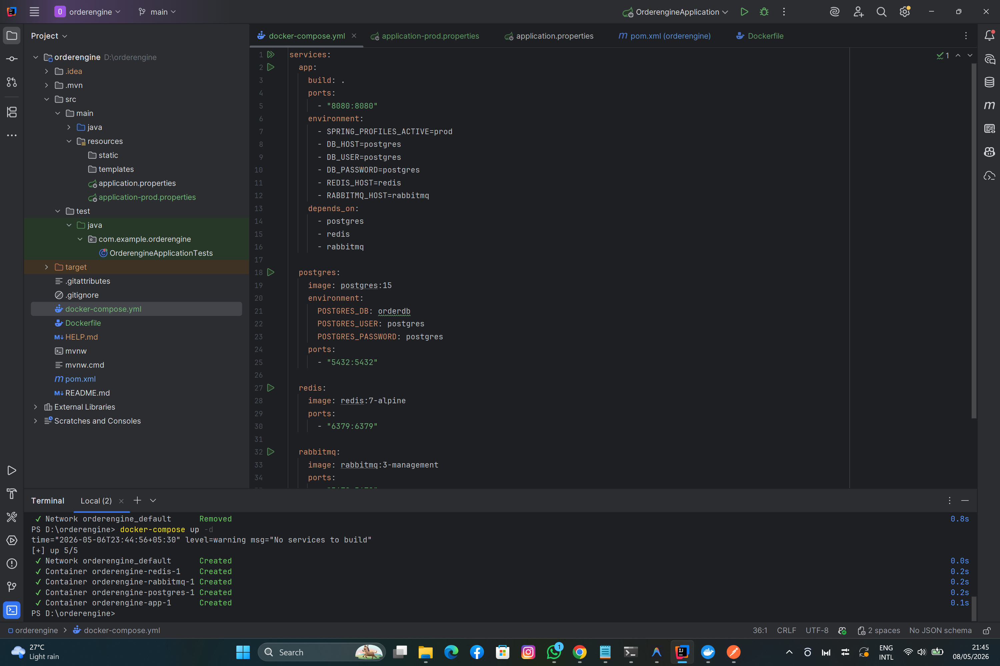

### Application Running on IntelliJ IDEA
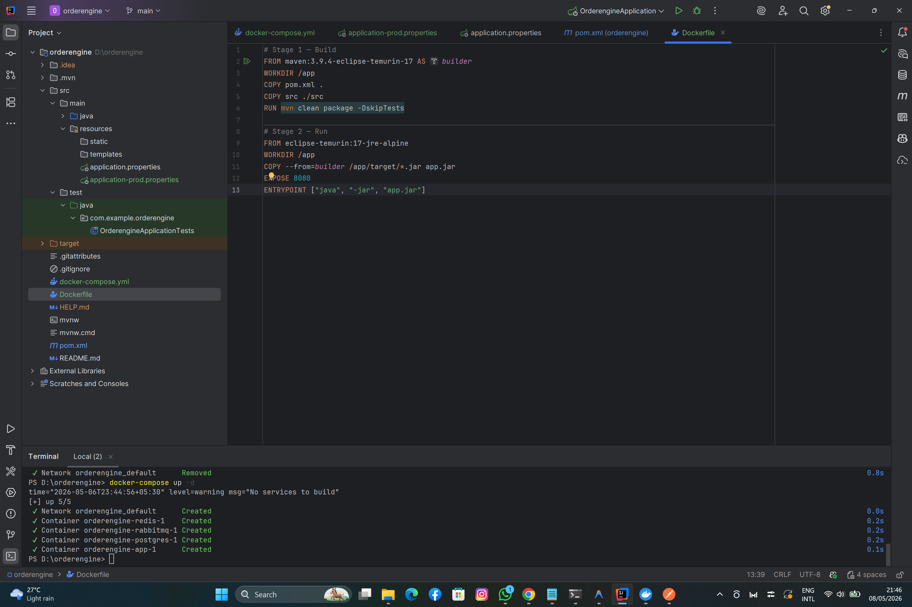

### SSH Connection
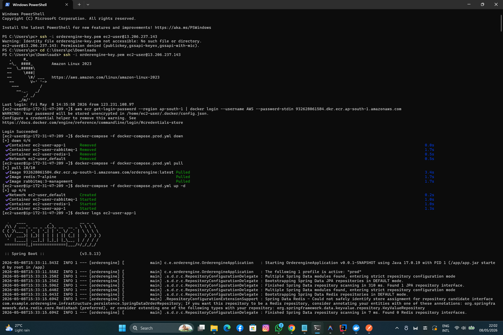

### SSH Connection
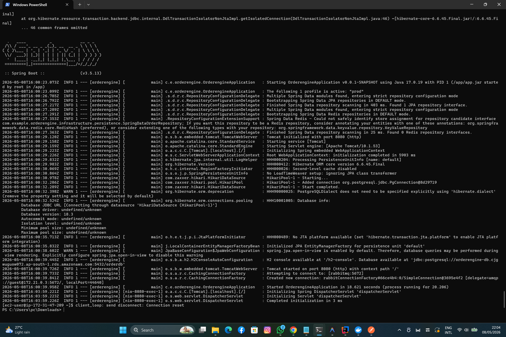

### AWS Console
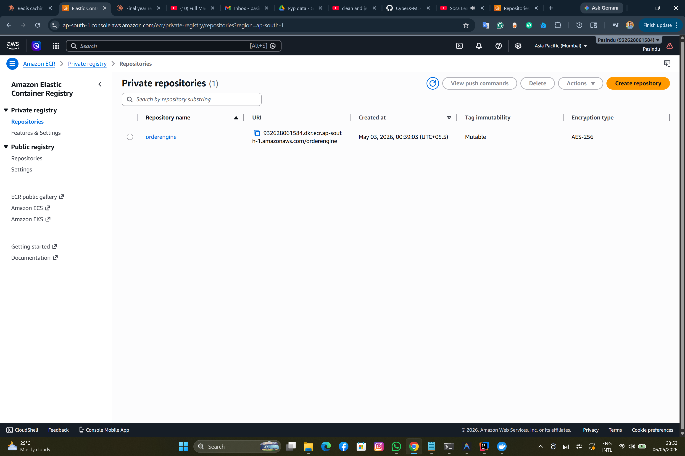

### AWS Console
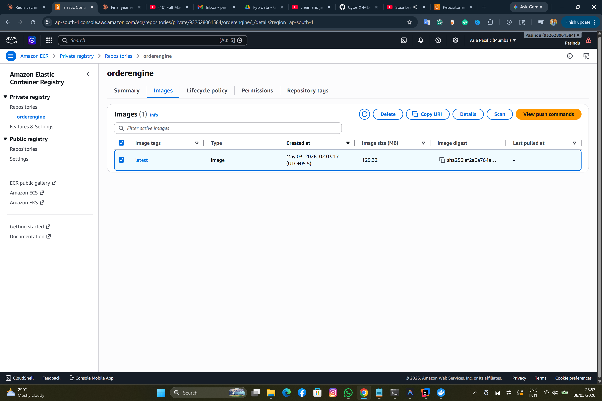

### AWS Console
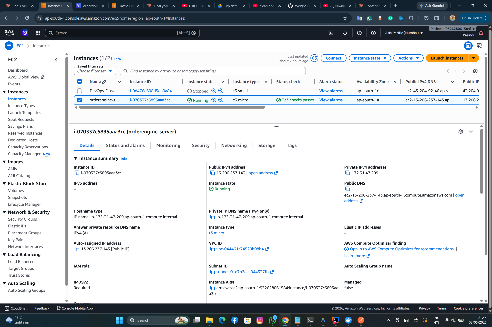

### AWS Console
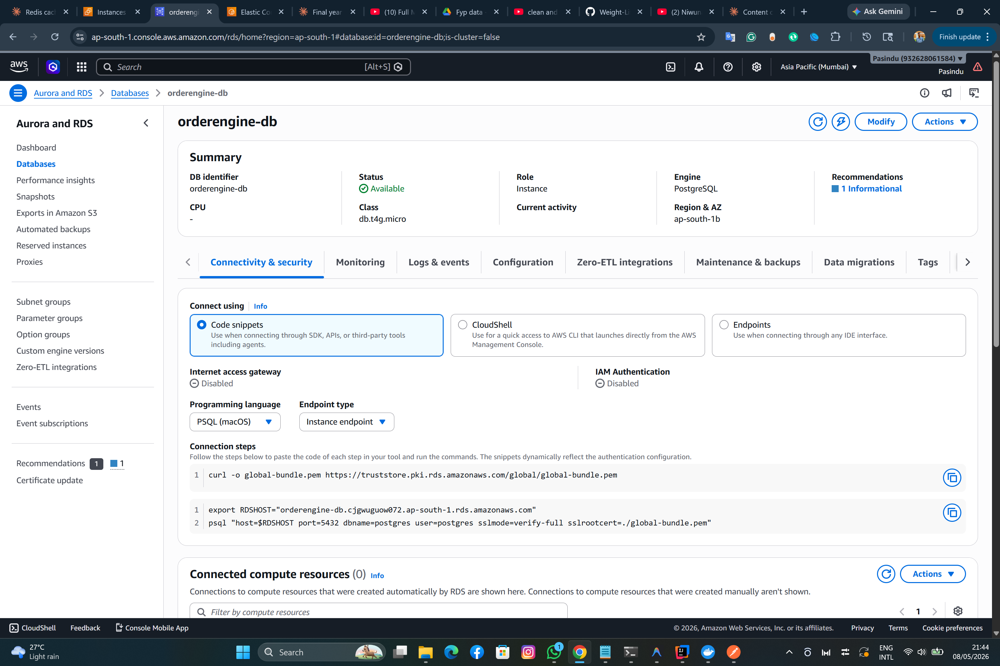

### AWS Console
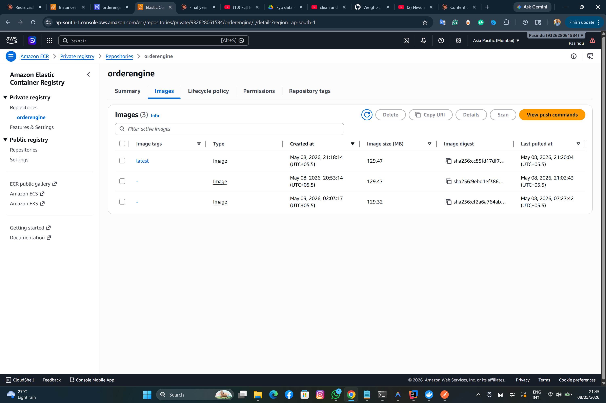

### Postman test with real IP
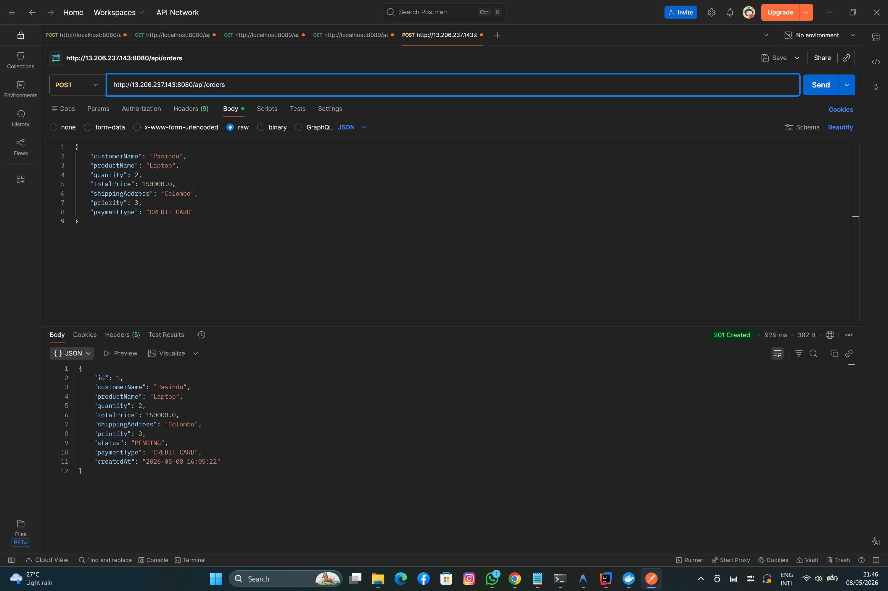

### Postman test with real IP
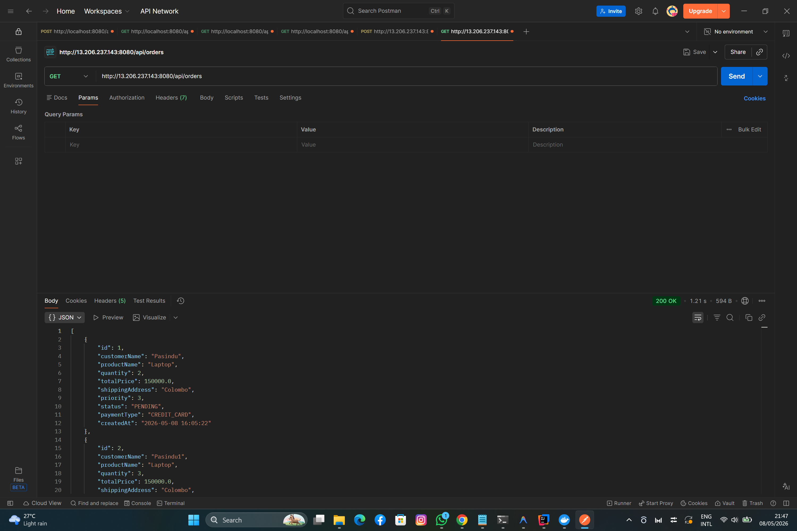
